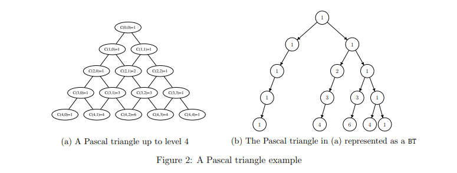

<<<<<<< HEAD
# CSC 212 Assignment 3: Implementing and Using Binary Trees
Guidelines
- This is an individual assignment.
- The assignment must be submitted to Web-CAT.

The goal of this assignment is to implement and use the ADT Binary Tree (BT). The
assignment is divided into three parts. In the first part, you will implement the ADT BT with
an augmented set of operations using linked representation. In the second and third parts, you
will write methods that use this implementation:

1. Given the following specification of the ADT Binary Tree, implement this data structure
using linked representation. You should write the class LinkedBT that implements the
interface BT.

## Specification of ADT BT
- full (boolean flag): requires: none. input: none. results: if the binary tree is full
then flag is set to true otherwise it is set to false. output: flag.
- empty (boolean flag): requires: none. input: none. results: If Binary tree is
empty then flag is set to true; otherwise flag is false. output: flag.
- retrieve (Type e): requires: Binary tree is not empty. input: none. results:
element in the current node is copied into e. output: e.
- update (Type e): requires: Binary tree is not empty. input: e. results: the
element in e is copied into the current node. output: none.
- insert (Type e, Relative rel, boolean inserted): requires: (1) full() is false, and (2)
if rel = Root then empty() is true, otherwise, rel 6= Parent and empty( ) is false.
input: e, rel. results: if (rel = leftChild and current node has a left child) or (rel
= rightChild and current node has a right child), then inserted is false. Otherwise
a node containing e is added as rel of the current node in the tree, the new node
becomes the current node, and inserted is true. output: inserted.
- deleteSub (): requires: Binary tree is not empty. input: none. results: The
subtree whose root node was the current node is deleted from the tree. If the
resulting tree is not empty, then the current node becomes the root node. output:
none.
- find (Relative rel, boolean found): requires: Binary tree is not empty. input: rel.
results: The current node of the tree is determined by the value of rel and previous
current node. output: found.
- depth(int d): requires: Binary tree is not empty. input: none. results: Returns
the depth of current element, d. The counting begins from 0, so the depth of the
root node is 0. The method should return without changing the current. output:
d.
2. Write a class called TestLinkedBT. In this class, you should implement the following static
method:
public static BT <Integer> buildTestTree()
This method will build and return exactly the tree shown in Figure 1 using the BT you
implemented in part (1). You should use the insert, find, and maybe other LinkedBT
methods to build the tree.

3. The Pascal triangle is a hierarchical arrangement of integer numbers, where each number
is the sum of the two numbers above it. Figure 2a shows a Pascal triangle of depth 4.
Each number in the Pascal triangle is in fact a binomial coefficient C(n, r) defined as:

As you can notice, the triangle is not exactly a tree as some nodes have more than one
parent. Therefore, to represent it as a BT, we adopt the convention shown in Figure 2b.

Your task is to write the class PascalTriangle that builds the BT representation of a pascal
triangle.

The class contains the following static methods:
(a) public static void findNR(BT<Integer> pt, int n, int r): Sets current to the node corresponding to C(n, r) in the Pascal triangle represented by the tree pt. Notice that
pt is a Pascal triangle represented as discussed above, and as shown in Figure 2b,
but it can be of any depth (not necessarily 4 as in the figure). Assume that C(n, r)
exists in pt.

**Example 1**. 
Assuming the tree in Figure 2b is named pt, calling findNR(pt, 4, 2)
sets pt.current to the node at the bottom middle (the 6). Calling findNR(pt, 0, 0)
sets pt.current to the root node.
(b) public static void addNR(BT<Integer> pt, int n, int r): Adds a new node corresponding to C(n, r) to the tree pt assuming the the nodes C(n − 1, r − 1) and C(n − 1, r)
already exist in the tree. To calculate C(n, r) you must retrieve the values of
C(n − 1, r − 1) and C(n − 1, r) from the tree. (Hint: use findNR).

## Deliverable and rules
You must deliver:
1. Source code submission to Web-CAT. You have to upload the following classed in a zipped
file:
• LinkedBT.java
• TestLinkedBT.java
• PascalTriangle.java
Notice that you should not upload the interface BT nor the enumeration Relative.
The submission deadline is: 03/04/2018.
You have to read and follow the following rules:
1. The specification given in the assignment (class and interface names, and method
signatures) must not be modified. Any change to the specification results in compilation
errors and consequently the mark zero.
2. All data structures used in this assignment must be implemented by the student. The
use of Java collections or any other data structures library is strictly forbidden.
3. This assignment is an individual assignment. Sharing code with other students will result
in harsh penalties.
4. Posting the code of the assignment or a link to it on public servers, social platforms or
any communication media including but not limited to Facebook, Twitter or WhatsApp
will result in disciplinary measures against any involved parties.
5. The submitted software will be evaluated automatically using Web-Cat.
6. All submitted code will be automatically checked for similarity, and if plagiarism is confirmed penalties will apply.
=======

